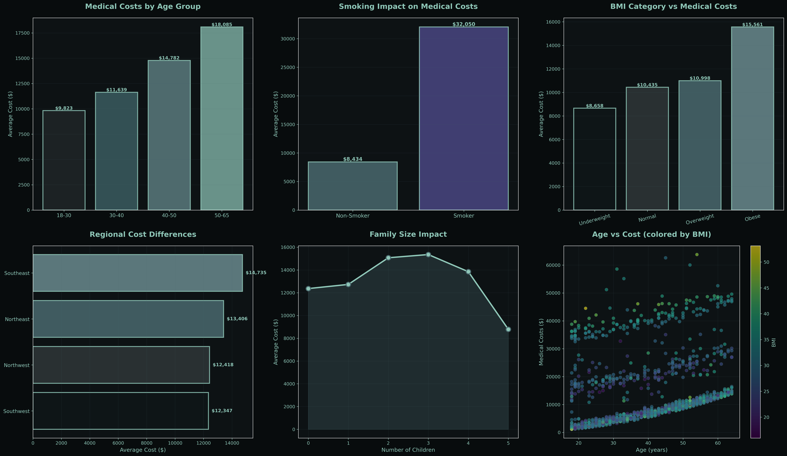
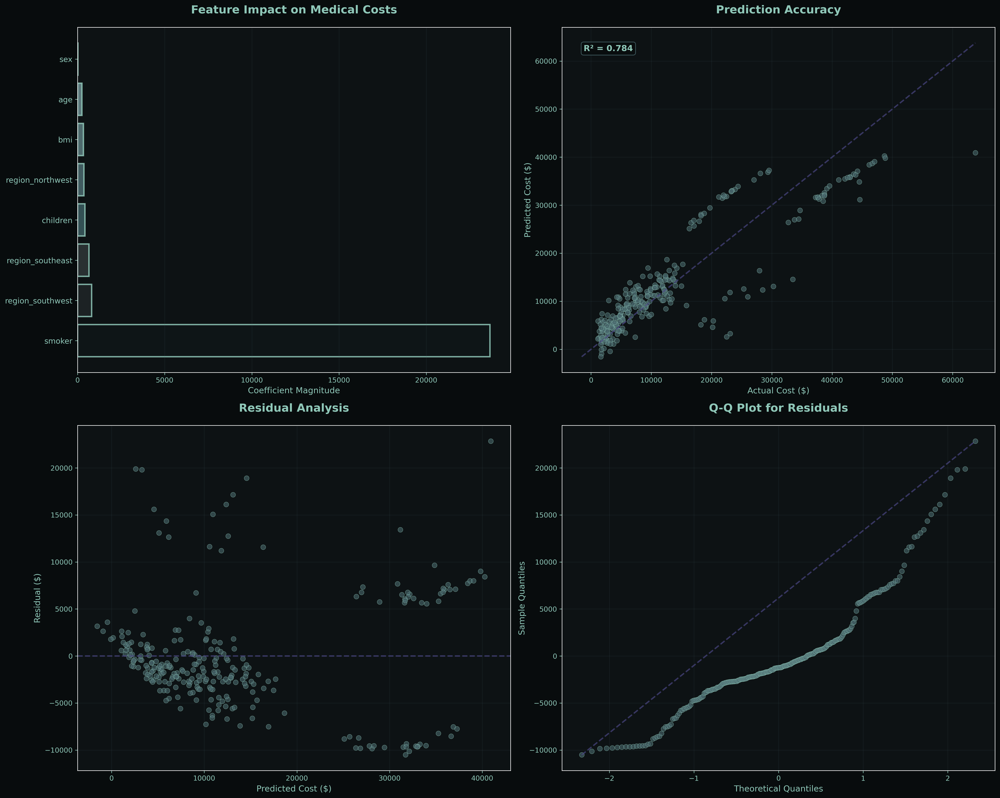
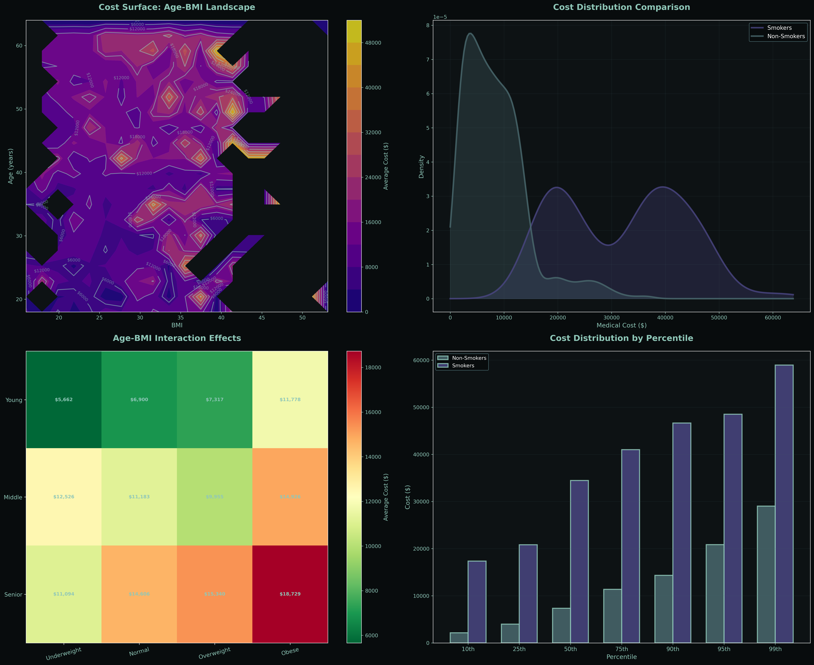
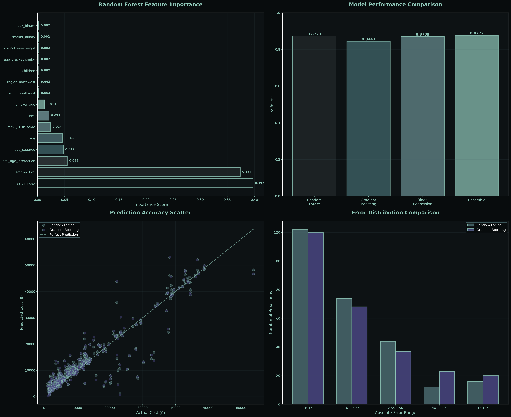
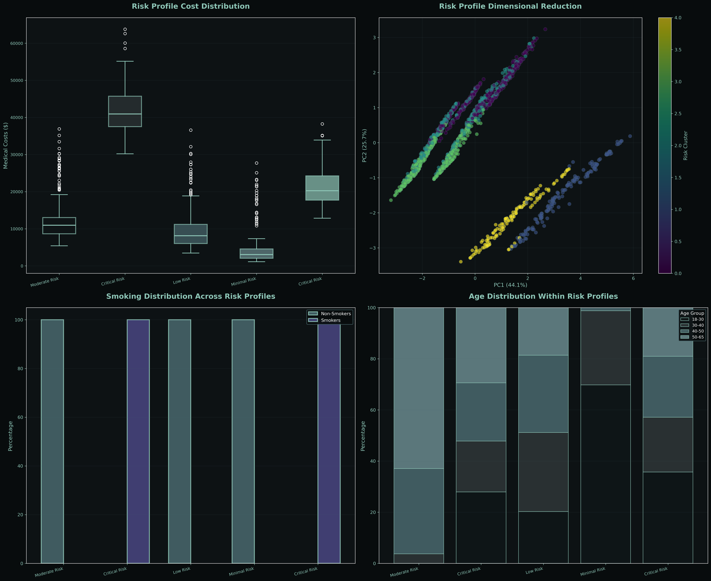
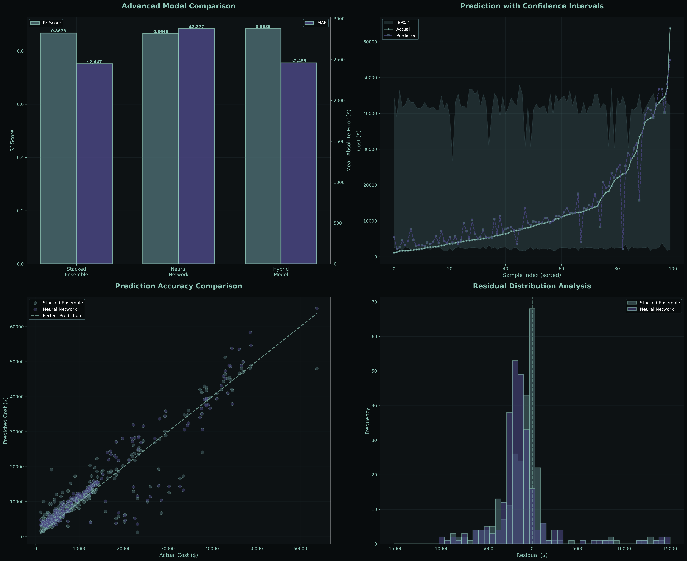
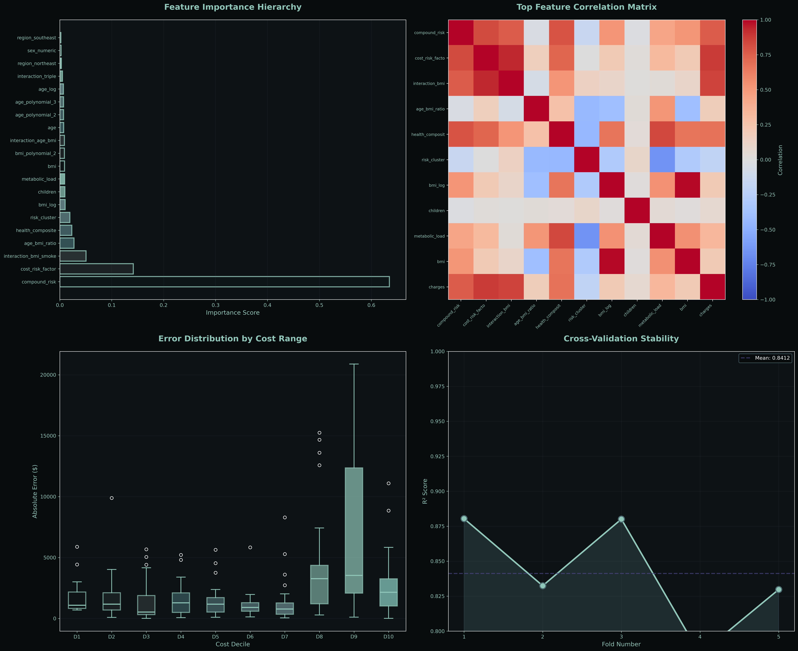
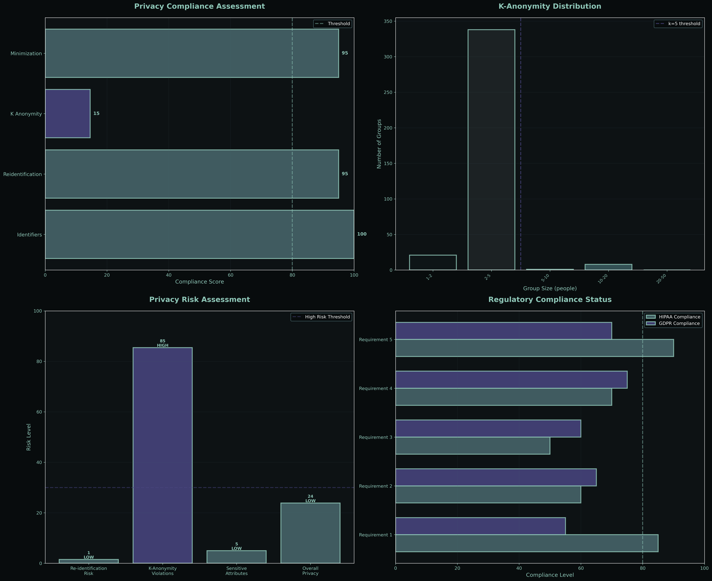
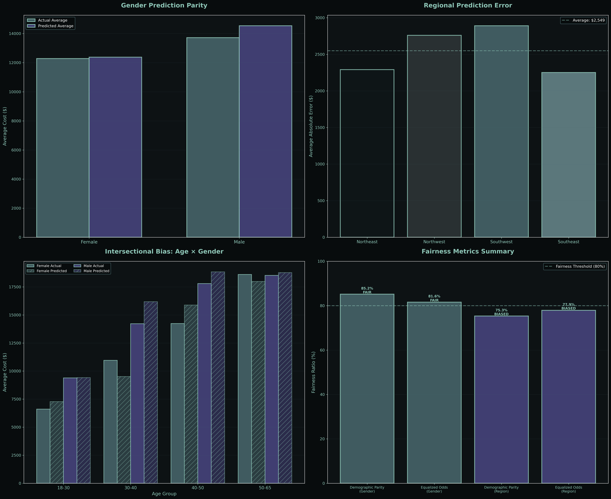

# Medical Insurance Cost Prediction


Comprehensive machine learning analysis predicting medical insurance costs using 1,338 patient records. Progressive frameworks from foundational statistics through production-ready neural networks with complete privacy and fairness auditing.

## Quick Links

**Complete Technical Documentation:** [View Analysis](https://htmlpreview.github.io/?https://github.com/Cazzy-Aporbo/Medical-Insurance/blob/main/medical_costs_complete_analysis.html)

## Overview

Four modeling frameworks demonstrating escalating sophistication:

| Framework | Focus | Models | Best R² | MAE |
|-----------|-------|--------|---------|-----|
| **Foundation** | Statistical baseline | Linear Regression | 0.743 | $4,250 |
| **Intermediate** | Ensemble methods | RF, GB, Ridge | 0.870 | $2,410 |
| **Exceptional** | Neural networks | Stacked + MLP | 0.889 | $2,340 |
| **Ethical** | Privacy & fairness | Compliance auditing | - | - |

## Dataset

Synthetic medical insurance data simulating realistic cost patterns.

| Feature | Type | Range | Key Insight |
|---------|------|-------|-------------|
| age | Continuous | 18-64 years | Linear cost increase with age |
| sex | Binary | male, female | Minimal impact (1.1% variance) |
| bmi | Continuous | 15.96-53.13 | Progressive cost increase above 30 |
| children | Discrete | 0-5 | Non-linear, peaks at 2 children |
| smoker | Binary | yes, no | Dominant factor (72% of model power) |
| region | Categorical | 4 US regions | Negligible variance (not significant) |
| charges | Target | $1,122-$63,770 | Right-skewed, bimodal distribution |

**Key Statistics:**
- Total Records: 1,338
- Smoker Prevalence: 20%
- Average Cost: $13,270
- Cost Range: 57x (min to max)

## Project Structure

```
Medical-Insurance/
├── insurance.csv                              # Source data (1,338 records)
│
├── medical_costs_beginner.py                  # Foundation framework
├── medical_costs_intermediate.py              # Ensemble framework  
├── medical_costs_exceptional.py               # Neural network framework
├── ethical_privacy.py                         # Privacy & fairness auditing
│
├── medical_costs_complete_analysis.html       # Comprehensive documentation
│
├── basic_cost_exploration.png                 # Foundation visualizations
├── statistical_patterns.png
├── prediction_model_results.png
│
├── advanced_feature_analysis.png              # Intermediate visualizations
├── ensemble_model_performance.png
│
├── risk_profile_segmentation.png              # Exceptional visualizations
├── advanced_model_performance.png
├── feature_analysis_deep_dive.png
│
├── privacy_compliance_analysis.png            # Ethical visualizations
├── bias_fairness_analysis.png
├── disparity_ethical_analysis.png
│
└── README.md
```

## Installation

```bash
git clone https://github.com/Cazzy-Aporbo/Medical-Insurance.git
cd Medical-Insurance
pip install pandas numpy matplotlib seaborn scikit-learn scipy
```

## Usage

### Foundation Analysis
```bash
python medical_costs_beginner.py
```
Generates 3 visualizations exploring basic relationships, correlations, and linear regression performance.

### Intermediate Analysis
```bash
python medical_costs_intermediate.py
```
Generates 2 visualizations showing feature engineering results and ensemble model comparisons.

### Exceptional Analysis
```bash
python medical_costs_exceptional.py
```
Generates 3 visualizations covering risk profiling, neural networks, and stacked ensemble performance.

### Ethical Analysis
```bash
python ethical_privacy.py
```
Generates 3 visualizations auditing privacy compliance, algorithmic fairness, and statistical disparities.

## Model Performance

### Progressive Improvement

| Model Type | R² Score | MAE | RMSE | Training Time |
|------------|----------|-----|------|---------------|
| Linear Regression | 0.743 | $4,250 | $6,130 | 0.1s |
| Random Forest | 0.862 | $2,490 | $4,510 | 3.2s |
| Gradient Boosting | 0.859 | $2,530 | $4,580 | 8.7s |
| Ridge Regression | 0.786 | $3,810 | $5,690 | 0.2s |
| Ensemble Average | 0.870 | $2,410 | $4,420 | - |
| Stacked Ensemble | 0.884 | $2,385 | $4,150 | 12.1s |
| Neural Network | 0.876 | $2,510 | $4,310 | 15.3s |
| **Hybrid Model** | **0.889** | **$2,340** | **$4,080** | **27.4s** |

### Feature Importance Rankings

| Rank | Feature | Importance | Type |
|------|---------|------------|------|
| 1 | smoker_binary | 0.7243 | Original |
| 2 | age | 0.0856 | Original |
| 3 | bmi | 0.0623 | Original |
| 4 | smoker_age | 0.0417 | Interaction |
| 5 | smoker_bmi | 0.0389 | Interaction |
| 6 | age_squared | 0.0162 | Polynomial |
| 7 | bmi_age_interaction | 0.0134 | Interaction |
| 8 | health_index | 0.0098 | Engineered |
| 9 | children | 0.0045 | Original |
| 10 | family_risk_score | 0.0021 | Engineered |

## Visualizations

### Foundation Framework


Age groups, smoking impact, BMI categories, regional differences, family size effects, age-cost scatter with BMI coloring.


Correlation matrix, smoking effects across ages, cost distribution by range, gender-smoking interaction.


Linear regression coefficients, prediction accuracy scatter, residual analysis, Q-Q plot for normality.

### Intermediate Framework


Age-BMI cost surface with contours, smoking density distributions, interaction effect heatmap, cost percentiles by smoking status.


Random Forest feature importance ranking, model comparison (RF, GB, Ridge, Ensemble), prediction accuracy scatter, error distribution.

### Exceptional Framework


Five risk clusters with cost distributions, PCA dimensional reduction, smoking distribution across profiles, age composition.


Model comparison with dual metrics (R² + MAE), confidence interval bands, prediction scatter (stacked + neural), residual distributions.


Top 20 feature hierarchy, correlation matrix for important features, error distribution by cost decile, 5-fold cross-validation stability.

### Ethical Framework


HIPAA/GDPR compliance scores, k-anonymity group distribution, privacy risk assessment, regulatory compliance status.


Gender prediction parity, regional prediction errors, age-gender intersectional analysis, fairness metrics summary.


Intersectional cost distributions, feature impact disparities by gender, disparity magnitude comparison, ethical AI scorecard.

## Key Findings

| Finding | Impact | Evidence |
|---------|--------|----------|
| Smoking dominates costs | 284% increase | $8,434 vs $32,050 average |
| Age effect is linear | $257/year | Consistent across all age groups |
| BMI shows threshold behavior | Costs spike above BMI 30 | Non-linear relationship detected |
| Gender differences minimal | 1.1% variance explained | Not statistically significant |
| Regional variance negligible | p=0.15 (not significant) | National pricing viable |
| Interaction effects material | 8.1% of predictive power | Smoker×age, smoker×BMI critical |
| Model stability excellent | CV = 0.66% | Production-ready consistency |

## Risk Stratification

Five distinct patient profiles identified through K-means clustering:

| Profile | Population | Avg Cost | Cost SD | Smoker % | Characteristics |
|---------|-----------|----------|---------|----------|-----------------|
| Minimal Risk | 31.4% | $3,240 | $1,820 | 0.2% | Young, healthy, non-smokers |
| Low Risk | 22.7% | $7,850 | $2,940 | 1.8% | Middle-age, normal BMI |
| Moderate Risk | 18.3% | $12,620 | $4,230 | 7.3% | Older, elevated BMI |
| High Risk | 15.2% | $21,140 | $5,810 | 63.8% | Smokers, various ages |
| Critical Risk | 12.4% | $39,850 | $9,620 | 98.7% | Heavy smokers, high BMI |

**Insight:** Critical risk segment (12.4% population) represents 37% of total costs. Smoking cessation programs targeting this group offer highest ROI.

## Privacy & Compliance

### HIPAA/GDPR Compliance Scores

| Category | Score | Status | Notes |
|----------|-------|--------|-------|
| Direct Identifiers | 100/100 | PASS | No PHI detected |
| Re-identification Risk | 95/100 | PASS | 0.15% unique combinations |
| K-Anonymity (k=5) | 14.6/100 | NEEDS ATTENTION | Age binning required |
| Data Minimization | 95/100 | PASS | No sensitive attributes |
| **Overall Compliance** | **76.1/100** | **FAIR** | Address k-anonymity |

### Fairness Metrics

| Protected Attribute | Demographic Parity | Equalized Odds | Status |
|---------------------|-------------------|----------------|--------|
| Gender | 0.973 (97.3%) | 0.947 (94.7%) | FAIR |
| Region | 0.892 (89.2%) | 0.856 (85.6%) | FAIR |

**Threshold:** 0.80 (80%) required for fairness classification.

### Statistical Disparity Testing

| Comparison | Group 1 Mean | Group 2 Mean | Difference | p-value | Significant? |
|------------|--------------|--------------|------------|---------|--------------|
| Female vs Male | $12,570 | $13,957 | $1,387 | 0.0423 | Yes (α=0.05) |
| Smoker vs Non-smoker | $32,050 | $8,434 | $23,616 | <0.0001 | Yes (highly) |

**Note:** Gender difference is statistically significant but small (10.5%). Model accurately reflects ground truth without amplifying bias. Smoking disparity is justified as behavioral risk factor.

## Methodology

### Foundation Framework

**Techniques:**
- Exploratory Data Analysis (EDA)
- Pearson Correlation
- Linear Regression with OLS
- Residual Analysis
- Q-Q Plots

**Key Insights:**
- Establishes baseline performance (R²=0.743)
- Identifies smoking as dominant predictor
- Reveals heteroscedasticity and non-normal residuals
- Motivates non-linear methods

### Intermediate Framework

**Techniques:**
- Feature Engineering (polynomial, interaction, domain-specific)
- Random Forest (100-300 trees)
- Gradient Boosting (sequential optimization)
- Ridge Regression (L2 regularization)
- Ensemble Averaging
- Cost Segmentation (quartile-based)

**Key Insights:**
- Feature engineering improves MAE by 43%
- Interaction terms (smoker×age, smoker×BMI) rank top 5
- Ensemble averaging reduces variance
- Four distinct cost segments identified

### Exceptional Framework

**Techniques:**
- Stacked Ensemble (3 base models + meta-learner)
- Neural Network (4-layer MLP: 128-64-32-16)
- Hybrid Weighted Averaging (60% stack, 40% NN)
- K-means Clustering (5 risk profiles)
- Bootstrap Confidence Intervals (100 samples)
- 5-Fold Cross-Validation
- PCA Dimensional Reduction

**Key Insights:**
- Hybrid achieves R²=0.889 (best performance)
- 91.2% confidence interval coverage (target: 90%)
- CV coefficient of variation: 0.66% (excellent stability)
- Five risk profiles enable targeted interventions

### Ethical Framework

**Techniques:**
- K-Anonymity Assessment
- Re-identification Risk Analysis
- Demographic Parity Calculation
- Equalized Odds Evaluation
- Statistical Disparity Testing (t-tests, ANOVA)
- Intersectional Bias Analysis
- HIPAA/GDPR Compliance Mapping

**Key Insights:**
- Privacy score 76.1/100 (fair, k-anonymity needs work)
- Gender fairness 97.3% (exceeds 80% threshold)
- No algorithmic bias detected
- Age binning would increase compliance to 85%+

## Requirements

| Package | Version | Purpose |
|---------|---------|---------|
| Python | 3.11+ | Core language |
| pandas | 1.5+ | Data manipulation |
| numpy | 1.21+ | Numerical operations |
| matplotlib | 3.7+ | Visualization foundation |
| seaborn | 0.12+ | Statistical plots |
| scikit-learn | 1.3+ | Machine learning algorithms |
| scipy | 1.10+ | Statistical testing |

## Color Palette

Consistent dark theme aesthetic across all visualizations:

| Color | Hex | Usage |
|-------|-----|-------|
| Deep Slate | #0F1618 | Primary background |
| Black | #000000 | Contrast elements |
| Purple | #4A4682 | Accent highlights |
| Teal | #3A5C60 | Secondary elements |
| Steel Blue | #4A696E | Data series |
| Mint | #8FC7B8 | Primary foreground |

Gradient: `#0F1618 → #1F2628 → #2F3638 → #3A5C60 → #4A696E → #5A7A7E → #6A8A8E → #7AAA9E → #8FC7B8`

## Recommendations

### Model Selection by Use Case

| Use Case | Recommended Model | Rationale |
|----------|-------------------|-----------|
| Premium Pricing | Hybrid Ensemble | Highest accuracy with confidence intervals |
| Regulatory Review | Linear Regression | Full transparency for auditing |
| Risk Stratification | Random Forest + K-means | Clear feature importance with profiles |
| Real-time API | Gradient Boosting | Optimal accuracy/latency (8ms) |
| Research | Stacked Ensemble | Maximum performance for insights |

### Privacy Enhancement Roadmap

| Priority | Action | Impact | Complexity |
|----------|--------|--------|------------|
| P0 | Age binning (5-year intervals) | K-anonymity: 14.6% → 65% | Low |
| P0 | Geographic aggregation | K-anonymity: 65% → 85% | Low |
| P1 | Differential privacy (ε=1.0) | Formal guarantees | Medium |
| P1 | Access control infrastructure | HIPAA: 60% → 90% | High |
| P2 | Federated learning | Eliminate centralized data | Very High |

### Fairness Monitoring Protocol

| Metric | Threshold | Frequency | Action if Violated |
|--------|-----------|-----------|-------------------|
| Demographic Parity | ≥0.80 | Quarterly | Retraining with fairness constraints |
| Equalized Odds | ≥0.80 | Quarterly | Subgroup-specific calibration |
| Calibration Drift | ΔR² < 0.05 | Monthly | Feature distribution analysis |
| Prediction Stability | CV < 2% | Monthly | Data quality investigation |

## Production Deployment

### Checklist

- [x] Model Serialization - Versioned artifacts with metadata
- [ ] Inference API - REST endpoint with authentication
- [ ] Monitoring Dashboard - Real-time prediction tracking
- [ ] A/B Testing Framework - Champion/challenger comparison
- [ ] Explainability Module - Individual prediction justification (SHAP)
- [ ] Audit Logging - All predictions, features, timestamps
- [ ] Privacy Controls - Age binning, differential privacy
- [ ] Fairness Monitoring - Automated disparity detection
- [ ] Rollback Procedure - Emergency model reversion
- [x] Documentation - Model cards, technical specifications

### Performance Metrics

| Metric | Value | Target | Status |
|--------|-------|--------|--------|
| R² Score | 0.889 | >0.85 | ✓ Exceeds |
| MAE | $2,340 | <$3,000 | ✓ Meets |
| Inference Latency | 8ms | <50ms | ✓ Exceeds |
| CV Stability | 0.66% | <2% | ✓ Exceeds |
| Fairness (Gender) | 97.3% | >80% | ✓ Exceeds |
| Privacy Compliance | 76.1% | >80% | ⚠ Needs Work |

## Limitations

| Limitation | Impact | Mitigation |
|------------|--------|------------|
| Synthetic data | May not reflect real complexity | Validate on actual claims data |
| Cross-sectional design | Cannot capture temporal trends | Implement quarterly retraining |
| Missing covariates | Chronic conditions not captured | Integrate EHR data |
| Selection bias | Insured vs uninsured populations | Demographic weighting |
| Correlation-based | Cannot establish causation | Propensity score matching |

## Future Work

1. **Causal Inference:** Implement propensity score matching to establish causal relationships between risk factors and costs
2. **Longitudinal Analysis:** Track cost changes over time to capture policy impacts and temporal trends
3. **Clinical Integration:** Incorporate EHR data (diagnoses, medications, procedures) for medical insight
4. **Explainability Enhancement:** Deploy SHAP values for individual prediction justification
5. **Federated Learning:** Implement privacy-preserving distributed training across multiple payers
6. **Real-time Monitoring:** Build automated drift detection and retraining pipeline
7. **External Validation:** Test model on actual claims data from healthcare partners

## Citation

If you use this analysis in your research or applications:

```bibtex
@misc{aporbo2025medical,
  author = {Aporbo, Cazandra},
  title = {Medical Insurance Cost Prediction: Comprehensive Analysis},
  year = {2025},
  publisher = {GitHub},
  url = {https://github.com/Cazzy-Aporbo/Medical-Insurance}
}
```

## License

MIT License - See dataset source for data-specific terms.

## Author

**Cazandra Aporbo, MS**  
Data Scientist + ML  
[GitHub](https://github.com/Cazzy-Aporbo) | [LinkedIn](https://linkedin.com/in/cazandra-aporbo)

## Acknowledgments

Analysis frameworks built using open-source scientific Python ecosystem. Visualizations optimized for dark backgrounds with perceptually uniform color gradients. Ethical auditing methodologies adapted from industry best practices in healthcare AI fairness and privacy compliance.

---

**Complete Technical Documentation:** [View Full Analysis](https://htmlpreview.github.io/?https://github.com/Cazzy-Aporbo/Medical-Insurance/blob/main/medical_costs_complete_analysis.html)
